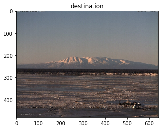

# Image-Blending-using-GP-GANs

# Goal
	Given two images source, destination and a mask, it is to blend destination into source in a manner that is visually appealing.

# Approaches tried
	We implemented an encoder-decoder network which takes low resolution(64X64) composite image(source cropped onto destination) and generates a low resolution image(64X64) which looks more natural than the composite.
	Using this low resolution image and using Laplacian pyramid we tried to optimize Gaussian-Poisson Equation
	i) By gradient Descent
	ii) Pyramid Blending

# Dependencies
	pytorch
	cv2
	numpy

# References 
	GP-GAN: Towards Realistic High-Resolution Image Blending https://arxiv.org/pdf/1703.07195.pdf

# Results

