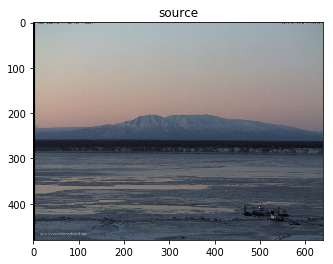
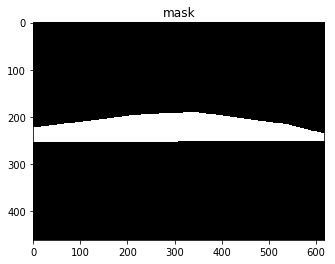
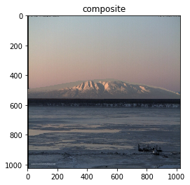
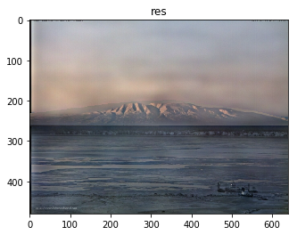
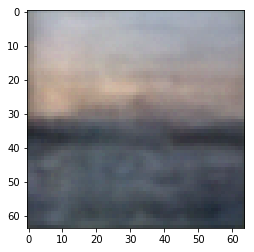

# Image-Blending-using-GP-GANs

## Goal
	Given two images source, destination and a mask, it is to blend destination into source in a manner that is visually appealing.

## Approaches tried
	We implemented an encoder-decoder network which takes low resolution(64X64) composite image(source cropped onto destination) and generates a low resolution image(64X64) which looks more natural than the composite.
	Using this low resolution image and using Laplacian pyramid we tried to optimize Gaussian-Poisson Equation
	i) By gradient Descent
	ii) Pyramid Blending

## Dependencies
	pytorch
	cv2
	numpy

## Instructions to Train
	Download the data from https://www.cse.iitb.ac.in/~charith/aligned_images.tar
	Create train test splits
	Create low resolution data by using savedata(train) in src/train.py
	Change hyperparameters as desired
	Run the train function

## Instructions to Blend
	run the script blend.py with arguments 
		-src source_img
		-dest dest_img
		-mask mask_img
		-model path_to_network_weights 

## References 
	GP-GAN: Towards Realistic High-Resolution Image Blending https://arxiv.org/pdf/1703.07195.pdf

## Results

Look at ImageBlending.ipynb for understanding code